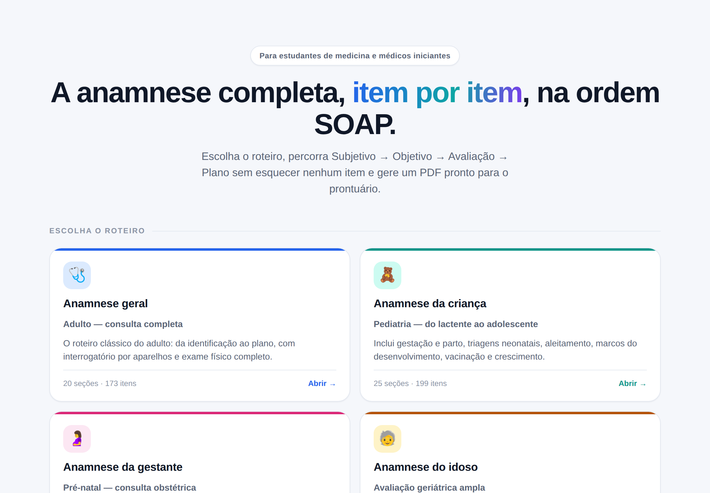
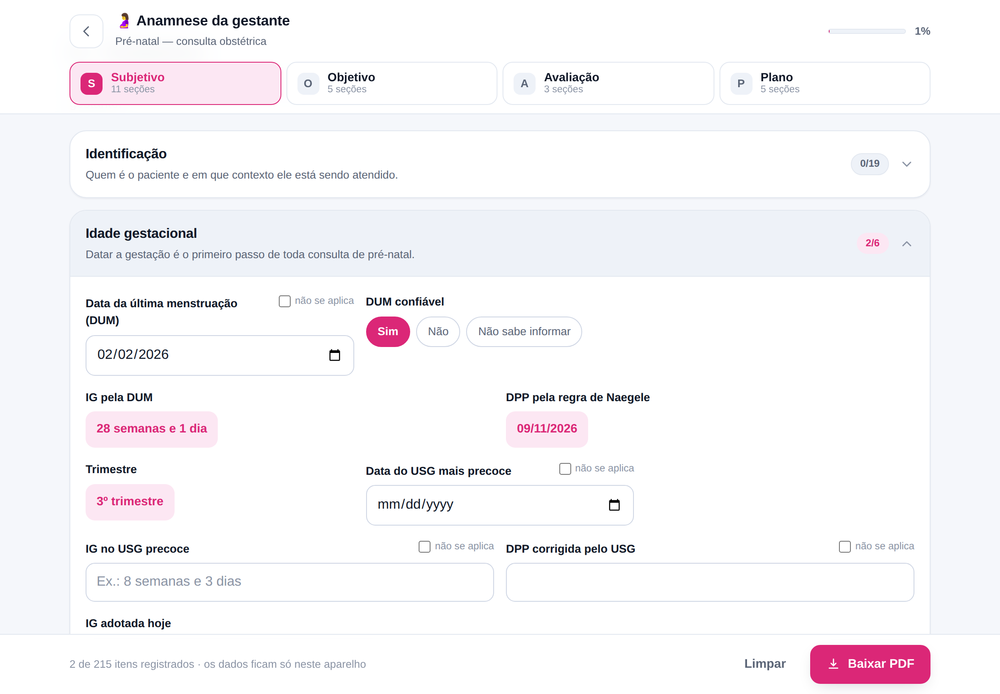

<h1 align="center">Anamnese</h1>

<p align="center">
  <strong>A anamnese completa, item por item, na ordem SOAP.</strong><br>
  Para estudantes de medicina e médicos iniciantes.
</p>

<p align="center">
  <a href="https://xkiroxkunx.github.io/anamnese-pwa/"><strong>▶ Abrir o app</strong></a>
</p>

---

Toda consulta segue um roteiro. O problema é lembrar dele inteiro — com o paciente na
frente, o tempo curto e a folha em branco. Este app coloca a anamnese completa na tela do
seu celular: você escolhe o roteiro, percorre os itens em ordem e, no fim, gera um PDF
pronto para o prontuário.

<p align="center">
  
</p>

## Quatro roteiros

| | Roteiro | O que ele cobre |
|---|---|---|
| 🩺 | **Anamnese geral** | O roteiro clássico do adulto: identificação, queixa, HDA, interrogatório por aparelhos, antecedentes, hábitos de vida, exame físico completo e plano. |
| 🧸 | **Anamnese da criança** | Tudo da pediatria que não existe no adulto: gestação e parto, triagens neonatais, aleitamento e introdução alimentar, marcos do desenvolvimento, cartão vacinal, curvas de crescimento e exame físico pediátrico. |
| 🤰 | **Anamnese da gestante** | O pré-natal inteiro: idade gestacional e DPP calculadas, antecedentes obstétricos, sintomas da gestação, painel de exames, exame obstétrico com altura uterina, BCF e manobras de Leopold. |
| 🧓 | **Anamnese do idoso** | A avaliação geriátrica ampla: funcionalidade (Katz e Lawton), cognição, humor, nutrição, quedas, polifarmácia, suporte social, testes de desempenho físico e fragilidade. |

## Como funciona

**Você percorre o SOAP.** As quatro abas no topo são Subjetivo, Objetivo, Avaliação e Plano.
Cada uma abre as seções daquele momento da consulta, e o contador mostra quantos itens de
cada seção já foram registrados — dá para ver de relance o que ficou para trás.

**Cada item tem seu campo.** Nada de campo de texto único: cada pergunta da anamnese tem o
formato certo. Datas em calendário, intensidade em escala de 0 a 10, sintomas em listas de
toque rápido, tempo de evolução com número e unidade. Quando um item não se aplica àquele
paciente, uma caixinha marca isso — e o PDF registra "não se aplica" em vez de deixar em
branco, porque perguntar e não se aplicar é diferente de esquecer.

**O app faz as contas.** Idade, IMC (com a faixa, e com os pontos de corte próprios do
idoso), pressão arterial média, carga tabágica, idade gestacional e data provável do parto
aparecem sozinhas conforme você preenche.

<p align="center">
  
</p>

**No fim, o PDF.** Um toque em *Baixar PDF* e o arquivo cai direto no seu aparelho — sem
passar pela tela de impressão. É um documento A4 com cabeçalho e o conteúdo organizado nos
quatro blocos do SOAP, só com os itens que você preencheu, sem linhas vazias. Guarde,
imprima ou anexe ao prontuário.

## No bolso, e sem enviar nada para lugar nenhum

O app **funciona offline**: depois da primeira visita, ele abre mesmo sem internet — útil no
plantão, no ambulatório do interior, no elevador do hospital.

Para instalar no celular, abra o link e use o menu do navegador: *Adicionar à tela de
início* (Android) ou *Compartilhar → Adicionar à Tela de Início* (iPhone). Ele passa a abrir
como um aplicativo, em tela cheia.

**Nada do que você digita sai do aparelho.** Não há servidor, cadastro, login ou envio de
dados: o preenchimento vive na memória do navegador até você gerar o PDF. Em compensação,
ele também não fica salvo — se fechar a aba, o formulário recomeça em branco (o app avisa
antes de sair).

> ⚠️ Ferramenta de apoio ao estudo e à organização do raciocínio clínico. Não substitui o
> julgamento do profissional, a orientação do preceptor nem o prontuário oficial da
> instituição.

## Rodando localmente

```bash
npm install
npm run dev
```

